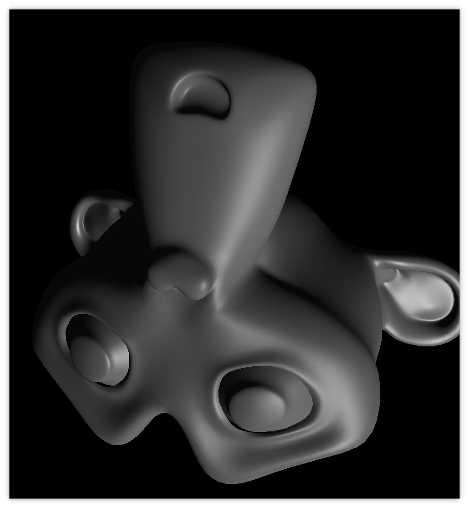

SimpleGraphics
===
A simple general software 3D graphics API written in C.  
The implementation still needs a lot of optimisation.

A small test is included (`./src/test.c`, `./test`, `./build/test.o`):

---
